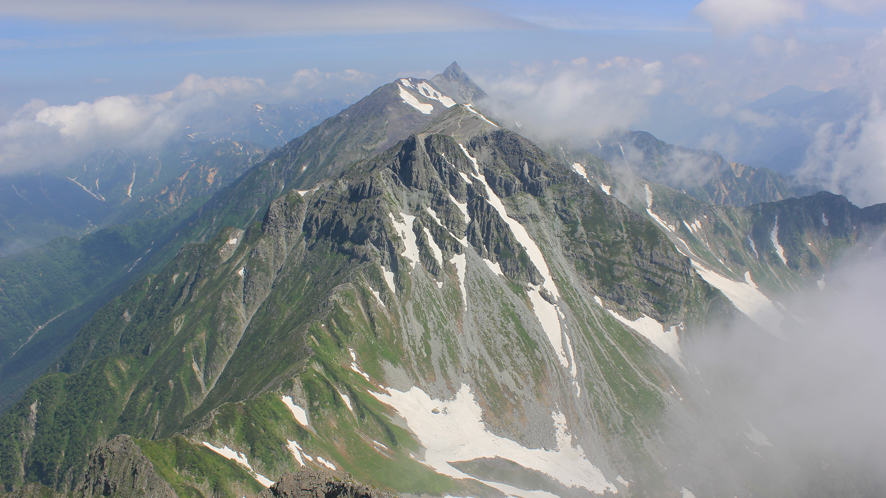
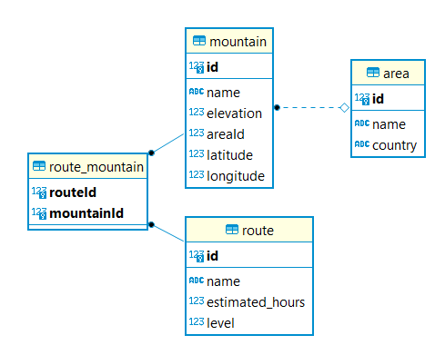
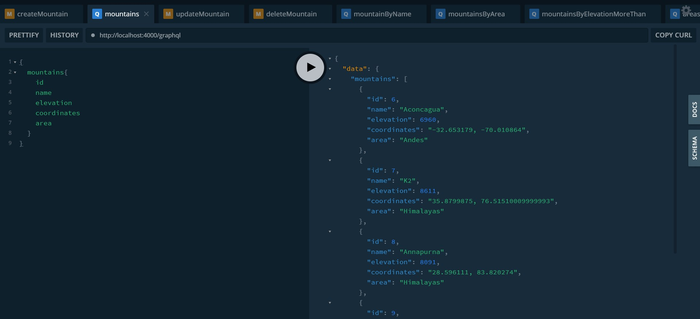

# CC16 project CRUD API

This was created during my time as a student at Code Chrysalis.

## Mountains API



This API enebles you to CRUD (create, read, update and delete) mountain database.
Mountain database mainly has 3 tables, mountain, area and route.
moutain table and area tables are connected in "many to one" relation.
route_mountain table is only for connecting moutain and route tables in "many to many" relation.



### Data samples

- mountain table

```sh
 id |       name       | elevation | areaId |      latitude      |     longitude
----+------------------+-----------+--------+--------------------+--------------------
  1 | Yarigatake       |      3180 |      1 |          36.341944 |         137.575869
  2 | Kita Hotakadake  |      3106 |      1 |          36.302543 |         137.652028
```

- area table

```sh
 id |       name        | country
----+-------------------+---------
  1 | Kamikochi         | Japan
  2 | Shin Hotaka Onsen | Japan
```

- route table

```sh
 id |         name          | estimated_hours | level
----+-----------------------+-----------------+-------
  1 | Dai Kiretto           |              31 |     4
  2 | Oku-Nishi Hotaka Juso |              25 |     5
```

### What you can do

Here are the methods you can use.

- `mountains` --- get all the mountains
- `mountainByName` --- get a mountain matching the input name
- `mountainsHigherThan` --- get mountains whose elevation is bigger than the input number
- `createMountain` --- insert a mountain, and push
- `updateMountain` --- update a mountain
- `deleteMountain` --- delete a mountain

- `areas` --- get all the areas from area table
- `createArea` --- insert an area
- `updateArea` --- update an area
- `deleteArea` --- delete an area

- `routes` --- get all the routes
- `routeByName` --- get a route matching the input name
- `routesHigherLevelThan` --- get routes whose level is bigger than the input number
- `routesLongerThan` --- get routes whose estimated_hours is bigger than the input number
- `createRoute` --- insert a route
- `updateRoute` --- update a route
- `deleteRoute` --- delete a route

- `addRouteMountain` --- insert a route-mountain pair

When creating or updatig the mountain table with an areaID, the related moutain data will be added to the matched area's "moutains" array.
Also when creating or updatig the area table with mountainIds, the areaId will be added to the matched moutains' "areaId".
On the other hand, moutain and route relations will be made only if you execute "addRouteMountain".
After establishing the relation, you can extract the connected data altogether like below.

```sh
{
  "id": 5,
  "name": "Oku Hotakadake",
  "elevation": 3190,
  "latitude": 36.290657853463465,
  "longitude": 137.6479692540915,
  "routes": [
    {
      "id": 2,
      "name": "Oku-Nishi Hotaka Juso",
      "level": 5,
      "estimated_hours": 25
    },
    {
      "id": 1,
      "name": "Dai Kiretto",
      "level": 4,
      "estimated_hours": 31
    }
  ],
  "area": {
    "id": 1,
    "name": "Kamikochi",
    "country": "Japan"
  }
}
```

UI is GrappfQL Playground(https://www.apollographql.com/docs/apollo-server/testing/graphql-playground/)


### Technologies

- TypeGraphQL
- Apollo server
- Express
- NodeJS
- TypeORM
- postgres
